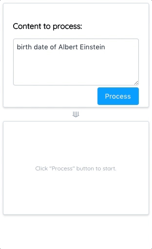

# DBpedia-Property-Plus 

A tool that supports you to include DBpedia data (properties of DBpedia entity) in your content. And more than that.

## Screenshots

1. General Usage 
2. Custom Recipe - 1, create with property data 
3. Custom Recipe - 2, run & save
4. Custom Recipe - 3, custom recipe suggestion

    

## Try it yourself

> I'm using virtual machines from the University of Southampton to host the application, so sadly you might not be able to access. However, you could follow the steps and setup up the application in your local enviroment.

1. Stanford CoreNLP Server

    > The first thing is to run a local Stanford CoreNLP server. The application needs Stanford parser to parse user input. The parsed data will be further processed by the server part of this project.

    Check this website: [Stanford CoreNLP Server](https://stanfordnlp.github.io/CoreNLP/corenlp-server.html), follow the steps and setup your local own server.

2. (DBpedia-Property-Plus) Server

    The server is developed using Tornado framework. Check this [website](http://www.tornadoweb.org/en/stable/) and install Tornado.

    Two most important modules you should install before running the server:
      1. nltk

            > This project uses NLTK to process the parsed sentence data mentioned above. It generates a NLTK tree. Then a simple algorithm is applied to extract entities from the tree according to POS tags of nodes.

            [Install NLTK](http://www.nltk.org/install.html)

            If any error related to NLTK occured when running the server script, that's probably because of missing of submodules. Read the log and download whatever needed. [Instructions](http://www.nltk.org/data.html) to follow.

      2. execjs

          > This project uses PyExecJS to execute `Custom Recipes` (which are some JavaScript scripts), and return the result to client. 

          [Install PyExecJS](https://pypi.python.org/pypi/PyExecJS)

    Once everything installed, `cd` to the directory of the `server.py` file and run `python server.py`.

    Oh! ONE MORE THING!**Change the value of `STANFORD_CORENLP_SERVER_URL` in `server.py` to the url of your local Stanford CoreNLP server.** Then run the server :D.
  
3. Application

    There is a `README.md` file in the application folder. Read it and you will know how to run it.

    If you don't have `npm` in your machine, install it. [get npm](https://www.npmjs.com/get-npm?utm_source=house&utm_medium=homepage&utm_campaign=free%20orgs&utm_term=Install%20npm)
  
## More thoughts on this project

This is my MSc. summer project, and I might just stop here.

The project itself does not involve anything sophistecated. It basically just combines multiple brilliant APIs and generates very simple content suggestions. 

However, I do think there is value in this project. 

1. With the help of it, you can get some useful information in a relative simple way.
2. The original idea of this project was using Open Data to support user writing. It, to some extent, has acompolished this purpose. What's interesting is that in return it helps to create more formated truthful data with the Custom Recipe function. With little modification of the source code, an API could be created to "replace" the DBpedia API. This API would be able to not only return what's in DBpedia, but also other userful information spotted or calculated from the existing data by its users. As you can see in the 4th screenshot, 48 properties and **3 custom recipes** were found. If a shared database could be set up in the cloud, and functions like "upload local recipes to cloud" and "download recipes from cloud" be added to the application, then this application will be much more powerful, and of course useful.

Hope you like it.
